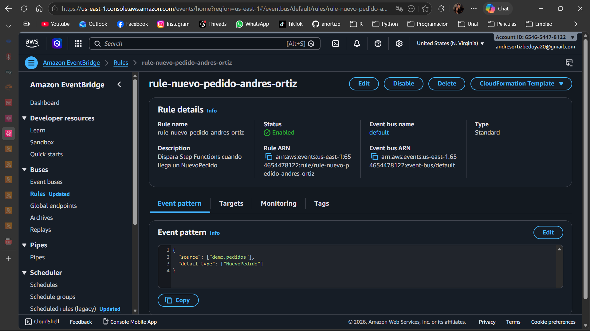
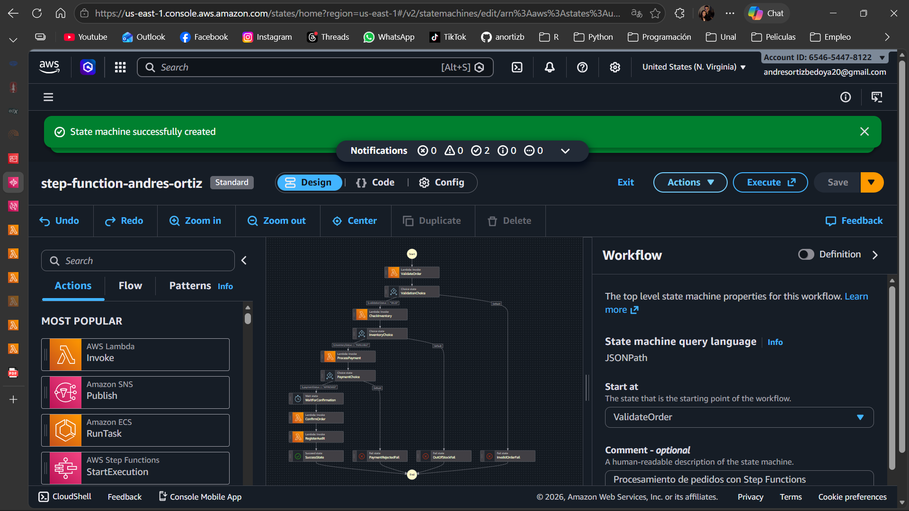
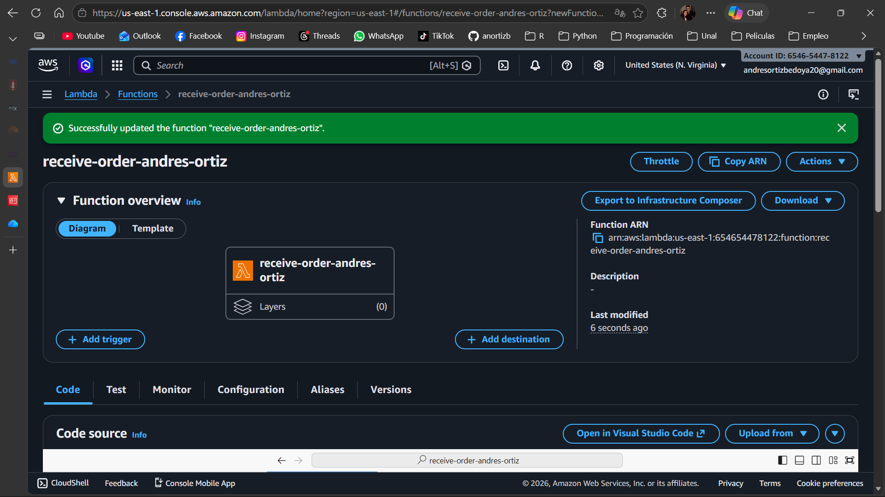
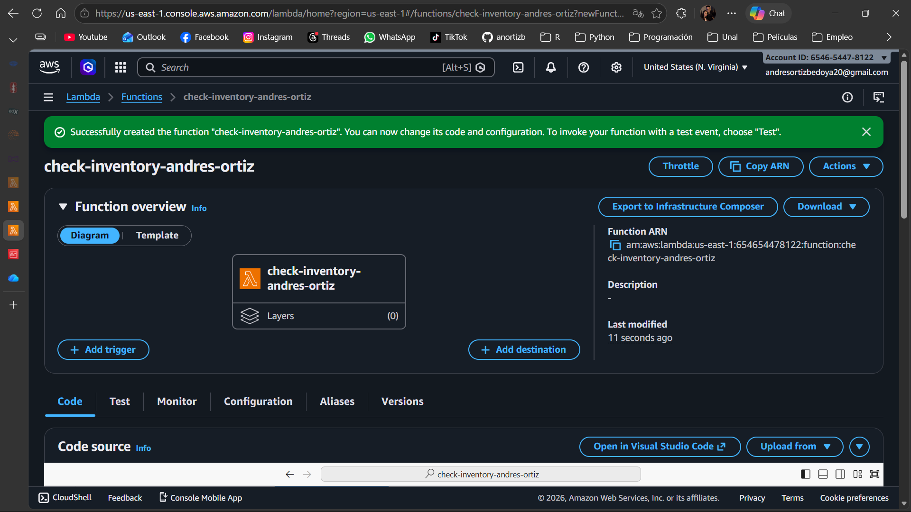
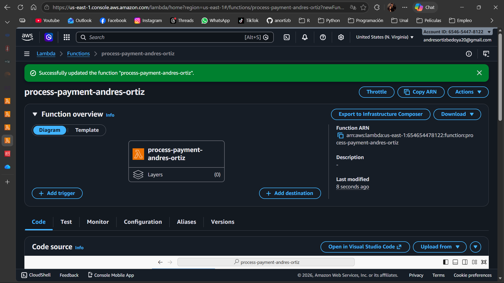
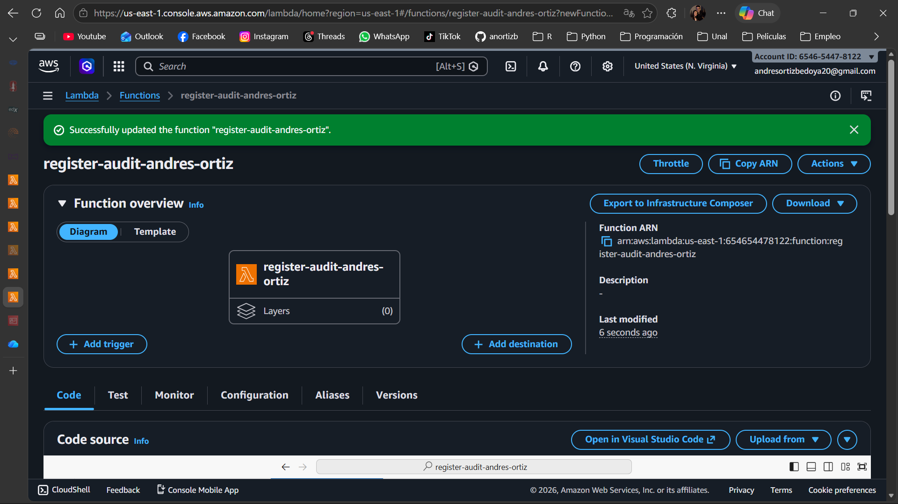

# Automatización de pedidos con AWS

**API Gateway + EventBridge + Step Functions + Lambda**

---

## 1. Descripción general

Implementación de un pipeline serverless orientado a eventos para procesamiento de pedidos. El sistema desacopla la ingestión, orquestación y ejecución mediante servicios administrados de AWS.

---

## 2. Arquitectura

```text
Cliente → API Gateway → Lambda (receive-order)
                      ↓
                 EventBridge
                      ↓
               Step Functions
                      ↓
 validate → inventory → payment → confirm → audit
```

---

## 3. Evidencia de implementación

## 3.1 EventBridge Rule

<p align="center">
  
</p>

<p align="center">
  <em>Regla configurada para capturar eventos "NuevoPedido"</em>
</p>

---

## 3.2 Step Function (Orquestación)

<p align="center">
  
</p>

<p align="center">
  <em>Flujo completo de procesamiento de pedidos</em>
</p>

---

## 3.3 Lambda: receive-order

<p align="center">
  
</p>

<p align="center">
  <em>Lambda encargada de recibir la solicitud y publicar el evento</em>
</p>

---

## 3.4 Lambda: validate-order

<p align="center">
  
</p>

<p align="center">
  <em>Validación de datos del pedido</em>
</p>

---

## 3.5 Lambda: check-inventory

<p align="center">
  
</p>

<p align="center">
  <em>Verificación de disponibilidad de inventario</em>
</p>

---

## 3.6 Lambda: process-payment

<p align="center">
  
</p>

<p align="center">
  <em>Procesamiento del pago</em>
</p>

---

## 3.7 Lambda: confirm-order

<p align="center">
  
</p>

<p align="center">
  <em>Confirmación del pedido</em>
</p>

---

## 3.8 Lambda: register-audit

<p align="center">
  
</p>

<p align="center">
  <em>Registro final de auditoría</em>
</p>

---

## 4. Implementación técnica

## 4.1 Lambda receive-order

Responsabilidades:

* Parsear request
* Generar `orderId`
* Publicar evento en EventBridge

```python
eventbridge.put_events(
    Entries=[
        {
            "Source": "demo.pedidos",
            "DetailType": "NuevoPedido",
            "Detail": json.dumps(order_detail),
            "EventBusName": "default"
        }
    ]
)
```

---

## 4.2 EventBridge

```json
{
  "source": ["demo.pedidos"],
  "detail-type": ["NuevoPedido"]
}
```

---

## 4.3 Step Functions (lógica)

Flujo:

1. ValidateOrder
2. Choice → INVALID → Fail
3. CheckInventory
4. Choice → OUT_OF_STOCK → Fail
5. ProcessPayment
6. Choice → REJECTED → Fail
7. Wait (5s)
8. ConfirmOrder
9. RegisterAudit
10. Success

---

## 5. API Gateway

Configuración:

* Tipo: HTTP API
* Método: POST
* Endpoint: `/pedido`
* Integración: Lambda `receive-order`

---

## 6. Prueba

```json
{
  "cliente": "Johan",
  "producto": "Laptop",
  "cantidad": 1,
  "total": 900
}
```

---

## 7. Resultados esperados

### Flujo exitoso

* VALID
* AVAILABLE
* APPROVED
* CONFIRMED

### Fallos controlados

* InvalidOrder
* OutOfStock
* PaymentRejected

---

## 8. Buenas prácticas

* Arquitectura event-driven
* Desacoplamiento con EventBridge
* Orquestación con Step Functions
* Funciones Lambda con responsabilidad única
* Uso de JSON como contrato

---

## 9. Limpieza de recursos

Eliminar:

* Lambdas
* Step Functions
* EventBridge Rule
* API Gateway

Para evitar costos innecesarios.

---

## 10. Estructura del repositorio

```text
.
├── README.md
└── images/
    ├── eventbridge-rule.png
    ├── step-function.png
    ├── receive-order.png
    ├── validate-order.png
    ├── check-inventory.png
    ├── process-payment.png
    ├── confirm-order.png
    └── register-audit.png
```

## Conclusión

Se implementó un pipeline serverless completo orientado a eventos, con separación clara de responsabilidades y control de flujo robusto mediante Step Functions.